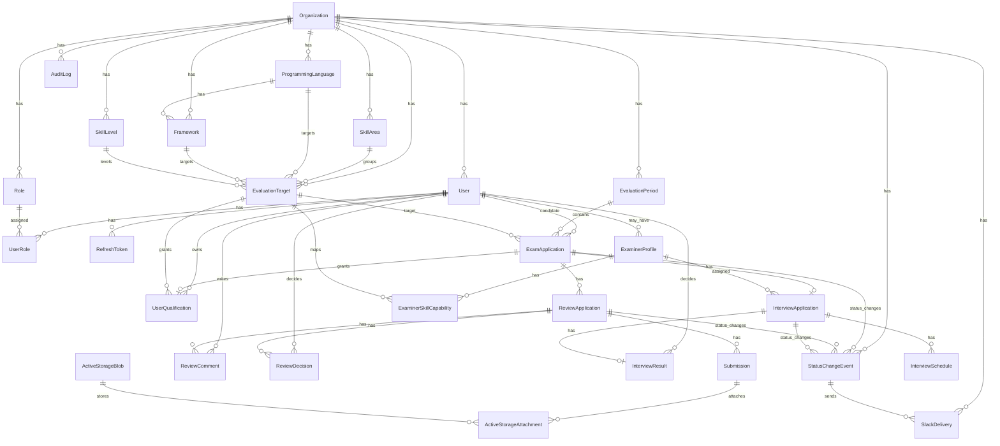

# SkillEvidenceHub 詳細設計書

作成日: 2026-06-20

## この文書の位置づけ

この文書はTODO 8「画面一覧、機能一覧、DB設計、権限設計、バリデーション、エラーハンドリング、テスト方針を定義する」の成果物である。

TODO 7の [要件定義書](/Users/haruki.shimo/Documents/ruby_study_lv2/docs/requirements_definition.md) を前提に、実装前に必要な設計粒度まで落とす。

## 設計方針

`SkillEvidenceHub` は、受験者が取得したい言語/Lvに対して受験表明を行い、その受験単位にレビュー依頼、提出物、評価面談応募、面談結果、取得資格を紐づける。

中心エンティティは `ExamApplication` とする。

- `EvaluationTarget`: 受験対象マスタ。言語/Lv/外部ナレッジ参照を持つ
- `ExamApplication`: 受験表明。レビュー依頼と面談応募の親
- `ReviewApplication`: 受験表明に紐づくレビュー依頼。1つの受験表明に複数作成できる
- `InterviewApplication`: 受験表明に紐づく面談応募
- `UserQualification`: 合格判定後に反映される取得資格

評価基準本文や大きな知識体系は外部ナレッジシステムで管理する。アプリ内では、受験対象の識別、提出・レビュー・面談・資格反映の業務証跡を管理する。

## 画面一覧

### 共通画面

| 画面 | 主な利用者 | 目的 | 主な操作 |
| --- | --- | --- | --- |
| ログイン | 全ユーザー | セッション開始 | メール/パスワードログイン |
| ログアウト | 全ユーザー | セッション終了 | ログアウト |
| ダッシュボード | 全ユーザー | 自分の作業入口 | 受験状況、レビュー待ち、面談予定、通知の確認 |
| ステータス変更履歴 | 全ユーザー | ReviewApplication/InterviewApplication等の状態変更履歴を確認する | 対象画面への遷移 |
| プロフィール | 全ユーザー | 自分の情報確認 | 名前、メール、所属の確認 |

### 受験者画面

| 画面 | 目的 | 主な操作 |
| --- | --- | --- |
| 受験表明一覧 | 自分の受験状況を確認する | 検索、状態確認、詳細遷移 |
| 受験表明作成 | 言語/Lvを指定して受験を開始する | 受験対象選択、申請作成 |
| 受験表明詳細 | 受験単位の全体状況を確認する | レビュー依頼作成、面談応募、履歴確認 |
| レビュー依頼作成/編集 | 提出物とアピールコメントを登録する | ファイル添付、GitHub URL、Markdownコメント入力、取消 |
| レビュー依頼詳細 | レビュー状態とコメントを確認する | 差し戻し対応、再提出 |
| 面談応募作成 | 評価面談を申し込む | 希望日時入力、取消不可の注意喚起、応募 |
| 面談詳細 | 面談日程と結果を確認する | Calendar登録状況、結果確認 |
| 取得資格一覧 | 合格済みの資格を確認する | 取得日、対象言語/Lv、根拠受験の確認 |

### 評価官画面

| 画面 | 目的 | 主な操作 |
| --- | --- | --- |
| 評価官ダッシュボード | 自分が対応可能な作業を確認する | レビュー待ち、面談調整待ち、面談予定の確認 |
| レビューキュー | 対応可能なレビュー依頼を確認する | 検索、ステータス絞り込み、詳細遷移 |
| レビュー詳細 | 提出物を確認して判定する | コメント、差し戻し、承認、却下 |
| 受験者検索 | 評価官が対応対象の受験者を検索する | 氏名、メール、言語/Lv、受験状態で検索 |
| 受験者詳細 | 受験者の受験状況と取得資格を確認する | 受験履歴、取得資格、レビュー履歴の確認 |
| 面談キュー | 対応可能な面談応募を確認する | 面接官未定の応募確認、割り振り変更、日程確認 |
| 面談詳細 | 面談対応と結果登録を行う | 日時承認、差し戻し、合格/不合格判定 |
| 対応可能スキル確認 | 自分の対応範囲を確認する | 言語/Lv/受験対象の確認 |

### 管理者画面

| 画面 | 目的 | 主な操作 |
| --- | --- | --- |
| 管理ダッシュボード | 全体状況を確認する | 未対応件数、承認率、面談数の確認 |
| ユーザー管理 | ユーザーを管理する | 登録、編集、停止、ロール付与 |
| ロール管理 | 権限の元データを管理する | ロール作成、権限確認 |
| 評価期管理 | 受験可能期間を管理する | 評価期作成、締切設定 |
| 受験対象マスタ管理 | 言語/Lv/外部ナレッジ参照を管理する | 登録、編集、無効化、検索 |
| 受験対象取込 | 受験対象をCSV/Excelから取り込む | ファイル選択、プレビュー、取込、エラー確認 |
| 評価官マスタ管理 | 評価官プロフィールを管理する | 有効化、面談対応可否、上限設定 |
| 対応可能評価スキル管理 | 評価官の担当範囲を管理する | 受験対象との紐づけ |
| 受験表明管理 | 全受験の状態を確認する | 検索、代理操作、履歴確認 |
| 取得資格管理 | 合格後の資格反映を確認する | 一覧、検索、根拠受験確認 |
| 監査ログ | 重要操作を追跡する | 操作種別検索、対象検索 |
| 帳票出力 | CSV/Excel/PDFを出力する | 受験対象、レビュー結果、提出状況、取得資格の出力 |
| 外部連携設定 | Slack/Google Calendar設定を確認する | mock/実連携の切替、接続確認 |

### API/開発補助画面

| 画面 | 目的 | 主な操作 |
| --- | --- | --- |
| OpenAPI UI | REST API仕様を確認する | API仕様表示 |
| GraphQL Playground相当 | GraphQL Query/Mutationを確認する | 開発環境のみ利用 |
| ジョブ管理簡易画面 | 非同期処理の状況を確認する | 失敗ジョブ確認、再実行 |

## 機能一覧

| 機能 | 概要 | 主な実装単位 |
| --- | --- | --- |
| 認証 | Deviseによる画面sessionログイン、API JWT、refresh token rotation | `User`, `Api::V1::AuthController`, `JwtToken`, `RefreshToken` |
| 認可 | 管理者/受験者/評価官、状態、対応可能スキルで制御 | `Role`, `UserRole`, Pundit policy |
| 受験対象管理 | 言語/Lv/外部ナレッジ参照のCRUD | `EvaluationTarget` |
| 受験対象取込 | CSV/Excel取込、プレビュー、行単位エラー | `EvaluationTargetImportJob`, `EvaluationTargetImporter` |
| 受験表明 | 受験者が言語/Lvを選び受験を開始 | `ExamApplication` |
| レビュー依頼 | 提出物、GitHub URL、Markdownコメントを登録 | `ReviewApplication`, `Submission` |
| レビュー判定 | 評価官コメント、差し戻し、承認、却下 | `ReviewDecision`, `ReviewComment` |
| 面談応募 | 受験表明に紐づく面談申込 | `InterviewApplication` |
| 評価官自動フィルイン | 面談対応数が少ない評価官を割り振りフォームの初期値として表示する。未確定時はDB保存しない | `ExaminerSuggestionService` |
| 面談割り振り変更 | 対象評価官が指定評価官を確定する | `InterviewAssignmentService` |
| Calendar連携 | 承認済み面談をGoogle Calendarへ登録 | `CalendarEventCreateJob`, `CalendarClient` |
| 合格判定 | 面談後に合格/不合格を登録 | `InterviewResult` |
| 取得資格反映 | 合格時にユーザー資格へ反映し受験をクローズ | `QualificationGrantService` |
| ステータス変更イベント | ReviewApplication/InterviewApplication等の状態変更履歴を保存する | `StatusChangeEvent` |
| Slack送信 | ステータス変更イベントをSlackへ送信する。アプリ内にSlack本文一覧は持たない | `SlackDeliveryJob`, `SlackClientFactory` |
| 監査ログ | 重要操作、認可失敗、状態遷移を記録 | `AuditLog`, `Auditable` |
| 検索 | Ransack等で許可条件のみ検索 | `Searchable`, query object |
| 帳票 | CSV/Excel/PDF出力 | `Exporters::*` |
| REST API | `/api/v1` のJSON API | `Api::V1::*Controller` |
| GraphQL | 受験表明/レビュー/資格のQuery/Mutation | `Types::*`, `Mutations::*` |
| ActionCable | レビュー/面談通知 | `NotificationsChannel` |

## 採用gem方針

| 用途 | 第一候補 | 方針 |
| --- | --- | --- |
| 画面認証 | `devise` | Web画面のsession認証、password hash、ログイン/ログアウトの土台に使う。業務固有の認可はPunditへ分離する |
| JWT | `jwt` | access tokenのencode/decodeに使う。署名アルゴリズムは固定し、decode時に明示する |
| DBスキーマ管理 | `ridgepole` | `db/Schemafile` をDB schemaの正とし、dry-run確認後にapplyする。データ移行は別タスクとして明示する |
| Markdown | `commonmarker` | GitHub Flavored Markdown寄りの表示に使う。HTML化後はRails sanitizerで許可タグだけに制限する |
| Markdown代替 | `redcarpet` | `commonmarker` が環境制約で使いづらい場合の代替候補。使う場合もHTML escape/filterとsanitizeを併用する |
| 論理削除 | `paranoia` | 業務テーブルは原則 `deleted_at` による論理削除に統一する |
| 認可 | `pundit` | role、状態、対応可能スキルによる認可をpolicyに集約する |
| 検索 | `ransack` | allowlistを必須にし、検索可能属性を明示する |
| 添付 | Active Storage | ReviewApplicationのSubmissionに複数添付を紐づける |
| Slack送信HTTP | `faraday` | Slack Incoming WebhookへPOSTする。通知gemは使わず、業務イベントと送信履歴は自前テーブルで管理する |
| PDF | `prawn` | 管理帳票出力で使う |
| Excel | `caxlsx` | 管理帳票出力で使う |

## 主要ステータス設計

### ExamApplication

| 状態 | 意味 |
| --- | --- |
| `draft` | 受験表明作成途中 |
| `declared` | 受験表明済み |
| `reviewing` | レビュー依頼対応中 |
| `review_approved` | レビュー承認済み |
| `interview_requested` | 面談応募済み |
| `interview_scheduled` | 面談日時確定済み |
| `passed` | 合格判定済み |
| `failed` | 不合格判定済み。再受験する場合は新しい受験表明から開始する |
| `canceled` | 受験取消 |
| `closed` | 受験単位クローズ |

合格時は `passed` を経て、取得資格反映と同一transactionで `closed` にする。不合格時は `failed` としてクローズし、再受験する場合は新しい `ExamApplication` を作成する。

### ReviewApplication

| 状態 | 意味 |
| --- | --- |
| `draft` | 提出前 |
| `submitted` | 提出済み |
| `in_review` | 評価官確認中 |
| `returned` | 差し戻し |
| `resubmitted` | 修正再提出 |
| `approved` | 承認 |
| `rejected` | 却下 |
| `canceled` | 取消 |

### InterviewApplication

| 状態 | 意味 |
| --- | --- |
| `requested` | 面談応募済み |
| `examiner_assigned` | 面談対応評価官確定済み |
| `schedule_requested` | 希望日時提出済み |
| `scheduled` | 日時承認済み |
| `calendar_created` | Calendar登録済み |
| `completed` | 面談完了 |

面談応募は取消不可とする。作成画面では、応募後に取消できないことを明示してから登録する。

## DB設計

### DBスキーマ管理方針

DBスキーマ管理はRails migration主体ではなく、`ridgepole` を採用する。`db/Schemafile` をスキーマ定義の正とし、実装IssueではSchemafileの変更、dry-run確認、apply結果をLoop Reportに残す。

方針:

- DB schema変更は `db/Schemafile` に集約する
- 実行前に `bundle exec ridgepole --apply --dry-run` 相当で差分を確認する
- 適用は `bundle exec ridgepole --apply` 相当で行う
- destructive changeやlockを伴う変更は、Issueに `human-review` を付けて確認を止める
- データ移行はRidgepoleに混ぜず、Rails taskまたは明示的なdata migrationとして別Issueで扱う
- Rails標準migrationは、gem初期導入などRidgepoleで表現しづらい補助用途に限定する

### 論理削除方針

業務データは原則として物理削除しない。`paranoia` を使い、対象テーブルに `deleted_at` を持たせる。

対象:

- users
- roles
- user_roles
- evaluation_periods
- skill_areas
- programming_languages
- frameworks
- skill_levels
- evaluation_targets
- exam_applications
- review_applications
- submissions
- review_comments
- review_decisions
- examiner_profiles
- examiner_skill_capabilities
- interview_applications
- interview_schedules
- interview_results
- user_qualifications
- status_change_events
- slack_deliveries

方針:

- 通常の一覧・検索では `deleted_at IS NULL` のデータだけを扱う
- 監査、履歴、管理者の復旧確認では `with_deleted` を使う
- 外部キー制約は維持し、親を削除しても子の参照が壊れないようにする
- 取り消し、却下、クローズなどの業務状態は `status` で表現する。`deleted_at` は「管理上の非表示/削除相当」に限定する
- unique制約は論理削除済みデータとの衝突を避けるため、PostgreSQLでは部分unique index、SQLiteではservice validationで補完する

### ER概要



### 主要テーブル

#### organizations

| カラム | 型 | 制約/説明 |
| --- | --- | --- |
| id | bigint | PK |
| name | string | NOT NULL |
| slug | string | NOT NULL, unique |
| created_at / updated_at | datetime |  |

#### users

| カラム | 型 | 制約/説明 |
| --- | --- | --- |
| id | bigint | PK |
| organization_id | bigint | FK, NOT NULL |
| name | string | NOT NULL |
| email | string | NOT NULL |
| password_digest | string | NOT NULL |
| active | boolean | default true |
| last_sign_in_at | datetime | nullable |
| lock_version | integer | optimistic lock |
| created_at / updated_at | datetime |  |

Index:

- unique: `[organization_id, email]`
- index: `[organization_id, active]`

#### roles

ロールはenumではなく固定マスタとして扱う。初期seedで `admin`, `candidate`, `examiner` を作成し、アプリ上では原則追加しない。

| カラム | 型 | 制約/説明 |
| --- | --- | --- |
| id | bigint | PK |
| organization_id | bigint | FK |
| code | string | `admin`, `candidate`, `examiner` |
| name | string | 表示名 |
| active | boolean | default true |
| created_at / updated_at | datetime |  |

Index:

- unique: `[organization_id, code]`

#### user_roles

ユーザーとロールの中間テーブル。評価官が受験者にもなれる可能性を閉じないため、多対多にする。

| カラム | 型 | 制約/説明 |
| --- | --- | --- |
| id | bigint | PK |
| user_id | bigint | FK |
| role_id | bigint | FK |
| created_at / updated_at | datetime |  |

Index:

- unique: `[user_id, role_id]`

#### evaluation_periods

| カラム | 型 | 制約/説明 |
| --- | --- | --- |
| id | bigint | PK |
| organization_id | bigint | FK |
| name | string | NOT NULL |
| starts_on | date | NOT NULL |
| ends_on | date | NOT NULL |
| active | boolean | default true |
| created_at / updated_at | datetime |  |

Validation:

- `starts_on <= ends_on`
- 同一組織内で同名重複不可

#### skill_areas

| カラム | 型 | 制約/説明 |
| --- | --- | --- |
| id | bigint | PK |
| organization_id | bigint | FK |
| name | string | 例: Backend |
| display_order | integer |  |
| active | boolean |  |

#### programming_languages

| カラム | 型 | 制約/説明 |
| --- | --- | --- |
| id | bigint | PK |
| organization_id | bigint | FK |
| name | string | 例: Ruby, Go |
| active | boolean |  |

unique: `[organization_id, name]`

#### frameworks

| カラム | 型 | 制約/説明 |
| --- | --- | --- |
| id | bigint | PK |
| organization_id | bigint | FK |
| name | string | 例: Rails |
| programming_language_id | bigint | FK, nullable |
| active | boolean |  |

#### skill_levels

| カラム | 型 | 制約/説明 |
| --- | --- | --- |
| id | bigint | PK |
| organization_id | bigint | FK |
| code | string | 例: Lv2, Lv3 |
| numeric_level | integer | 検索/並び順用 |
| active | boolean |  |

unique: `[organization_id, code]`

#### evaluation_targets

受験対象マスタ。評価基準本文は持たず、外部ナレッジ参照を持つ。

| カラム | 型 | 制約/説明 |
| --- | --- | --- |
| id | bigint | PK |
| organization_id | bigint | FK |
| skill_area_id | bigint | FK |
| programming_language_id | bigint | FK |
| framework_id | bigint | FK, nullable |
| skill_level_id | bigint | FK |
| external_knowledge_url | string | nullable |
| external_knowledge_key | string | nullable |
| description | text | 管理用説明 |
| version | string | 外部ナレッジ参照の版 |
| display_order | integer |  |
| active | boolean | default true |
| lock_version | integer | optimistic lock |
| created_at / updated_at | datetime |  |

Index:

- unique: `[organization_id, programming_language_id, framework_id, skill_level_id, version]`
- index: `[organization_id, active, display_order]`
- index: `[programming_language_id, skill_level_id]`

#### exam_applications

受験表明。レビュー依頼と面談応募の親。

| カラム | 型 | 制約/説明 |
| --- | --- | --- |
| id | bigint | PK |
| organization_id | bigint | FK |
| evaluation_period_id | bigint | FK |
| candidate_id | bigint | FK users |
| evaluation_target_id | bigint | FK |
| attempt_number | integer | 1始まり。再受験時に増える |
| status | integer | enum |
| declared_at | datetime | 受験表明日時 |
| closed_at | datetime | クローズ日時 |
| result | integer | enum: none/passed/failed/canceled |
| result_decided_at | datetime | 最終判定日時 |
| lock_version | integer | optimistic lock |
| created_at / updated_at | datetime |  |

Index:

- unique: `[organization_id, evaluation_period_id, candidate_id, evaluation_target_id, attempt_number]`
- index: `[organization_id, status]`
- index: `[candidate_id, status]`
- index: `[evaluation_target_id, status]`

同一評価期・同一受験者・同一受験対象で、`closed` ではない受験表明は1件までとする。この制約はDB部分indexを使える環境ではDBで、SQLite等ではservice validationで担保する。

#### review_applications

| カラム | 型 | 制約/説明 |
| --- | --- | --- |
| id | bigint | PK |
| organization_id | bigint | FK |
| exam_application_id | bigint | FK |
| sequence_number | integer | 受験内のレビュー依頼番号 |
| status | integer | enum |
| appeal_markdown | text | 受験者の任意コメント |
| rendered_appeal_html | text | サニタイズ済みHTML |
| submitted_at | datetime |  |
| canceled_at | datetime | nullable |
| cancel_reason | text | nullable |
| decided_at | datetime |  |
| decided_by_id | bigint | FK users, nullable |
| lock_version | integer | optimistic lock |
| created_at / updated_at | datetime |  |

Index:

- unique: `[exam_application_id, sequence_number]`
- index: `[organization_id, status]`
- index: `[exam_application_id, status]`

`ExamApplication has_many ReviewApplications` とする。同じ受験の中で、初回レビュー、差し戻し後の再依頼、証跡差し替えを別レコードとして保持できるようにする。ただし、同時に進行できるレビュー依頼は1件までとし、service validationで制御する。

#### submissions

`Submission` は、1つのレビュー依頼に対して複数の証跡を持たせるためのテーブルである。GitHubリポジトリ、zip、PDF、補足資料などを同じ `ReviewApplication` に紐づけ、種別ごとのvalidation、表示、差し替え履歴を分離する。単一カラムに押し込むと、ファイルとURLが増えた時に変更に弱くなるため分ける。

| カラム | 型 | 制約/説明 |
| --- | --- | --- |
| id | bigint | PK |
| review_application_id | bigint | FK |
| kind | integer | enum: file/github_repository/supplement |
| github_url | string | kindがgithub_repositoryの場合必須 |
| title | string | 表示名 |
| note | text | 任意補足 |
| created_at / updated_at | datetime |  |

ファイル実体はActive Storageで管理する。GitHub URL提出の場合はActive Storage添付不要。

Active Storageの標準テーブルである `active_storage_blobs` と `active_storage_attachments` はRails側が管理するため、個別の業務テーブルとしては定義しない。

#### review_comments

| カラム | 型 | 制約/説明 |
| --- | --- | --- |
| id | bigint | PK |
| review_application_id | bigint | FK |
| examiner_id | bigint | FK users |
| body_markdown | text | NOT NULL |
| rendered_body_html | text | サニタイズ済みHTML |
| created_at / updated_at | datetime |  |

#### review_decisions

`ReviewComment` と `ReviewDecision` は分ける。コメントは会話・補足・確認履歴として複数件残すためのもの、decisionはレビュー依頼の状態を変える判定イベントとして扱うためのものである。これにより、コメントだけ追加した場合と、差し戻し/承認/却下で状態が変わった場合を監査上もテスト上も分離できる。

| カラム | 型 | 制約/説明 |
| --- | --- | --- |
| id | bigint | PK |
| review_application_id | bigint | FK |
| examiner_id | bigint | FK users |
| decision | integer | enum: return/approve/reject |
| reason_markdown | text | 差し戻し/却下/承認理由 |
| decided_at | datetime | NOT NULL |
| created_at / updated_at | datetime |  |

#### examiner_profiles

| カラム | 型 | 制約/説明 |
| --- | --- | --- |
| id | bigint | PK |
| user_id | bigint | FK users, unique |
| active | boolean | default true |
| can_review | boolean | default true |
| can_interview | boolean | default true |
| monthly_interview_count | integer | 提案用キャッシュ |
| max_monthly_interviews | integer | nullable |
| created_at / updated_at | datetime |  |

#### examiner_skill_capabilities

| カラム | 型 | 制約/説明 |
| --- | --- | --- |
| id | bigint | PK |
| examiner_profile_id | bigint | FK |
| evaluation_target_id | bigint | FK |
| can_review | boolean | default true |
| can_interview | boolean | default true |
| active | boolean | default true |
| created_at / updated_at | datetime |  |

unique: `[examiner_profile_id, evaluation_target_id]`

#### interview_applications

| カラム | 型 | 制約/説明 |
| --- | --- | --- |
| id | bigint | PK |
| organization_id | bigint | FK |
| exam_application_id | bigint | FK |
| status | integer | enum |
| assigned_examiner_profile_id | bigint | FK, nullable |
| assignment_overridden_by_id | bigint | FK users, nullable |
| assignment_override_reason | text | nullable |
| requested_at | datetime |  |
| lock_version | integer | optimistic lock |
| created_at / updated_at | datetime |  |

Index:

- unique: `[exam_application_id]`
- index: `[organization_id, status]`
- index: `[assigned_examiner_profile_id, status]`

受験者画面では、`assigned_examiner_profile_id` が未設定の間は「面接官未定」と表示する。評価官が割り振り画面を開いた時点で `ExaminerSuggestionService` が候補者を算出し、フォームの初期値にフィルインする。保存されるのは確定した `assigned_examiner_profile_id` のみであり、初期提案状態はDBに持たない。

#### interview_schedules

| カラム | 型 | 制約/説明 |
| --- | --- | --- |
| id | bigint | PK |
| interview_application_id | bigint | FK |
| starts_at | datetime | NOT NULL |
| ends_at | datetime | NOT NULL |
| timezone | string | default Asia/Tokyo |
| status | integer | enum: requested/approved/rejected/calendar_created |
| google_calendar_event_id | string | nullable |
| calendar_error_message | text | nullable |
| created_at / updated_at | datetime |  |

#### interview_results

| カラム | 型 | 制約/説明 |
| --- | --- | --- |
| id | bigint | PK |
| interview_application_id | bigint | FK |
| examiner_id | bigint | FK users |
| result | integer | enum: passed/failed |
| comment_markdown | text | 判定コメント |
| decided_at | datetime | NOT NULL |
| created_at / updated_at | datetime |  |

unique: `[interview_application_id]`

#### user_qualifications

| カラム | 型 | 制約/説明 |
| --- | --- | --- |
| id | bigint | PK |
| organization_id | bigint | FK |
| user_id | bigint | FK users |
| evaluation_target_id | bigint | FK |
| exam_application_id | bigint | FK |
| acquired_on | date | NOT NULL |
| granted_by_id | bigint | FK users |
| revoked_at | datetime | nullable |
| created_at / updated_at | datetime |  |

Index:

- unique: `[organization_id, user_id, evaluation_target_id]`
- index: `[organization_id, acquired_on]`

#### status_change_events

ReviewApplication、InterviewApplication、ExamApplicationなどの状態変更履歴を保存する。Slack本文を保存するためのものではない。

「通知一覧」として既読/未読を管理するのではなく、ユーザーが閲覧可能な対象リソースに紐づく状態変更履歴として扱う。たとえば、レビュー依頼詳細では該当 `ReviewApplication` のイベント、面談詳細では該当 `InterviewApplication` のイベント、ダッシュボードでは自分に関係する受験・レビュー・面談の直近イベントを表示する。

| カラム | 型 | 制約/説明 |
| --- | --- | --- |
| id | bigint | PK |
| organization_id | bigint | FK |
| actor_id | bigint | FK users, nullable |
| subject_type | string | polymorphic |
| subject_id | bigint | polymorphic |
| from_status | string | nullable |
| to_status | string | NOT NULL |
| event_type | string | 例: review_approved, interview_assigned |
| message | text | アプリ内表示用の短い説明 |
| metadata | jsonb | 表示補助情報。SQLiteではtext/json |
| target_path | string | 画面遷移先パス |
| deleted_at | datetime | paranoia |
| created_at | datetime |  |

Index:

- index: `[organization_id, subject_type, subject_id, created_at]`
- index: `[organization_id, event_type, created_at]`

#### slack_deliveries

Slack送信の実行履歴を保存する。アプリ内通知一覧ではなく、外部連携の送信成否を監査・再実行するためのテーブルである。

Slack本文そのものをユーザー向け通知として見せる設計にはしない。Slackへ送る文面は `StatusChangeEvent` から組み立て、送信結果だけを `SlackDelivery` に残す。

| カラム | 型 | 制約/説明 |
| --- | --- | --- |
| id | bigint | PK |
| organization_id | bigint | FK |
| status_change_event_id | bigint | FK |
| webhook_name | string | 送信先識別子 |
| delivery_status | integer | enum: pending/succeeded/failed |
| payload | jsonb | 送信payload。SQLiteではtext/json |
| response_code | integer | nullable |
| response_body | text | nullable |
| delivered_at | datetime | nullable |
| error_message | text | nullable |
| retry_count | integer | default 0 |
| deleted_at | datetime | paranoia |
| created_at / updated_at | datetime |  |

#### audit_logs

| カラム | 型 | 制約/説明 |
| --- | --- | --- |
| id | bigint | PK |
| organization_id | bigint | FK |
| actor_id | bigint | FK users, nullable |
| action | string | NOT NULL |
| auditable_type | string | polymorphic |
| auditable_id | bigint | polymorphic |
| ip_address | string |  |
| user_agent | string |  |
| before_changes | jsonb | PostgreSQL時。SQLiteではtext/json |
| after_changes | jsonb | PostgreSQL時。SQLiteではtext/json |
| created_at | datetime |  |

#### refresh_tokens

JWT access tokenのencode/decodeは `jwt` gemを使う。`refresh_tokens` はJWTを自作するためのテーブルではなく、短命access tokenを再発行するためのrefresh tokenをハッシュ化して保存し、rotation/revokeを管理するために持つ。

| カラム | 型 | 制約/説明 |
| --- | --- | --- |
| id | bigint | PK |
| user_id | bigint | FK |
| token_digest | string | NOT NULL |
| expires_at | datetime | NOT NULL |
| revoked_at | datetime | nullable |
| created_at / updated_at | datetime |  |

## 設計判断メモ

### ExamApplication has many ReviewApplications

`ExamApplication` は複数の `ReviewApplication` を持つ。1つの受験の中で、提出内容の差し替え、差し戻し後の再依頼、補足資料追加を別のレビュー依頼として残せるためである。

ただし、同時に進行できるレビュー依頼は1件までにする。これにより、評価官が同じ受験に対して並行して別々の判定を行う状態を避ける。

### Submissionを分ける理由

`Submission` はレビュー依頼に紐づく証跡の入れ物である。ファイル、GitHubリポジトリ、補足資料はvalidationも表示も異なるため、`ReviewApplication` にURLや添付を直接持たせない。

この分離により、1つのレビュー依頼に複数ファイルとGitHub URLを併用でき、証跡差し替えや拡張時の変更範囲を抑えられる。

### ReviewCommentとReviewDecisionを分ける理由

`ReviewComment` は会話・補足・確認履歴であり、状態を変えない。

`ReviewDecision` は差し戻し、承認、却下など、`ReviewApplication` の状態を変える判定イベントである。

両者を分けることで、コメントだけ追加された場合と、業務状態が変わった場合を明確に分離できる。監査ログ、通知、テストも分けやすい。

### 通知gemを使わない理由

今回の通知要件は、メール、SMS、ブラウザ通知などの汎用通知基盤ではなく、`ReviewApplication` や `InterviewApplication` の状態変更イベントを記録し、必要なものをSlackへ送信することである。

そのため、`noticed` のような高機能通知gemは初期実装では使わない。業務イベントは `StatusChangeEvent`、Slack送信履歴は `SlackDelivery` として自前テーブルで管理する。SlackへのHTTP送信は `Faraday` を使う。

将来、メール通知、アプリ内既読通知、複数チャネル配信が必要になった場合は、`noticed` の導入を再検討する。

## 権限設計

### 基本方針

- 画面はsession認証、APIはJWT認証を使う
- 認可はPundit policyで集約する
- すべての主要テーブルは `organization_id` でテナントスコープする
- ロールはenumではなく `roles` / `user_roles` で管理し、初期seedで固定ロールを作る
- 評価官は `ExaminerSkillCapability` に一致する受験対象だけを確認/対応できる
- 受験者は自分の受験表明、レビュー依頼、面談応募、取得資格のみ操作できる
- 管理者は全体管理できるが、監査ログに操作を残す

### 操作権限

| 操作 | 管理者 | 受験者 | 評価官 |
| --- | --- | --- | --- |
| 受験対象マスタ閲覧 | 可 | 可 | 可 |
| 受験対象マスタ登録/編集/無効化 | 可 | 不可 | 不可 |
| 受験表明作成 | 代理可 | 自分のみ可 | 不可 |
| 受験表明閲覧 | 可 | 自分のみ可 | 対応可能分のみ可 |
| 受験表明取消 | 代理可 | 自分のみ可 | 不可 |
| レビュー依頼作成/編集 | 代理可 | 自分のみ可 | 不可 |
| レビュー依頼閲覧 | 可 | 自分のみ可 | 対応可能分のみ可 |
| レビューコメント | 可 | 不可 | 対応可能分のみ可 |
| 差し戻し/承認/却下 | 可 | 不可 | 対応可能分のみ可 |
| 面談応募作成 | 代理可 | 自分のみ可。作成後取消不可 | 不可 |
| 面談評価官自動フィルイン | 可 | 不可 | 対応可能分のみ可 |
| 面談評価官手動変更 | 可 | 不可 | 対応可能分のみ可 |
| 面談日時承認/差し戻し | 可 | 不可 | 対応可能分のみ可 |
| 合格/不合格判定 | 可 | 不可 | 対応可能分のみ可 |
| 取得資格閲覧 | 可 | 自分のみ可 | 対応可能分のみ可 |
| 取得資格反映 | 可 | 不可 | 合格判定時のみ可 |
| 監査ログ閲覧 | 可 | 不可 | 不可 |

## バリデーション設計

### 共通

- すべての入力文字列に最大長を設定する
- Markdown入力は保存時に原文を保持し、表示用HTMLは `commonmarker` でHTML化した後にRails sanitizerでサニタイズしたものだけを使う
- URLはHTTP/HTTPSのみ許可する
- 同一organization内のFK整合を必ず検証する
- 状態遷移はmodel validationだけでなくservice/policyで制御する

### EvaluationTarget

- 言語、Lvは必須
- 外部ナレッジURLまたは外部ナレッジ識別子のどちらかを推奨。最低限どちらか1つを入力する
- 同一organization、言語、framework、Lv、versionの重複不可
- 無効化済みの受験対象は新規受験表明で選択不可

### ExamApplication

- candidate、evaluation_period、evaluation_targetは必須
- 同一評価期、同一受験者、同一受験対象、同一attempt_numberの重複不可
- 同一評価期、同一受験者、同一受験対象で未クローズの受験表明は1件まで
- 評価期の期間外は作成不可
- `closed` 後はレビュー依頼、面談応募、判定を変更不可
- `passed`/`failed` への変更は面談結果登録経由のみ許可
- 不合格後に再受験する場合は、次の `attempt_number` で新しい受験表明を作成する

### ReviewApplication

- `exam_application` は必須
- `exam_application` が存在しない場合は作成不可
- 1つの受験表明に対してレビュー依頼は複数作成できる
- 同じ受験表明内で同時に進行中のレビュー依頼は1件まで
- 提出時は提出物またはGitHub URLのいずれかが必須
- `appeal_markdown` は最大10,000文字
- `approved`/`rejected`/`returned` は対応可能評価官または管理者のみ可能
- `draft`, `submitted`, `returned` のレビュー依頼は受験者本人または管理者が取消できる
- `approved`, `rejected`, `canceled` のレビュー依頼は取消不可
- コメント、判定、提出物が紐づくレビュー依頼は物理削除しない。削除相当の操作は `canceled` と `canceled_at` で表現する

### Submission

- `kind` は必須
- `github_repository` の場合、GitHub URLは `https://github.com/{owner}/{repo}` 形式のみ許可
- fileの場合、Active Storage添付必須
- ファイルサイズ上限は20MBを初期値にする
- 許可拡張子は `.zip`, `.pdf`, `.md`, `.txt`, `.png`, `.jpg`, `.jpeg`, `.docx`, `.xlsx`, `.pptx`

### ReviewComment / ReviewDecision

- 評価官は対応可能な受験対象に対してのみ登録可
- コメント本文は1文字以上、5,000文字以内
- 差し戻し/却下時は理由必須
- 同じレビュー依頼が既に最終判定済みの場合、追加判定不可
- コメント作成/更新時は、親の `ReviewApplication` が存在し、かつ `canceled`, `approved`, `rejected` ではないことを検証する
- コメント編集画面を開いた後に親レビュー依頼が取消された場合、更新時に409または422で失敗させ、画面側では最新状態を再読み込みする
- DB外部キーは `review_comments.review_application_id` から `review_applications.id` へ張り、親レビュー依頼の物理削除は `restrict` する

### InterviewApplication

- `exam_application` は必須
- 1つの受験表明に対して面談応募は1件まで
- 面談応募は受験表明が `declared`, `reviewing`, `review_approved` のいずれかの場合に作成可
- 面談応募は取消不可。作成画面で取消不可の注意喚起を表示し、確認後に登録する
- 自動フィルインは割り振りフォームの初期値であり、未確定の候補はDB保存しない
- 手動変更時は変更者と理由を保存する
- 割り振り先評価官は対象受験の言語/Lvに対応可能であること

### InterviewSchedule

- `starts_at < ends_at`
- 過去日時は不可
- タイムゾーンは `Asia/Tokyo` を初期値にする
- 承認済み日程の変更は監査ログ必須
- Calendar作成済みの場合、再作成は冪等性キーで二重登録を防止する

### InterviewResult / UserQualification

- 面談結果は1つの面談応募に対して1件まで
- 合格/不合格判定者は割り当て済み評価官または管理者のみ
- 合格時は `UserQualification` 作成、`ExamApplication` クローズ、ステータス変更イベント作成を同一transactionで行う
- 同一ユーザー、同一受験対象の資格重複不可

## エラーハンドリング設計

### 例外クラス

| 例外 | 用途 |
| --- | --- |
| `InvalidTransitionError` | 不正な状態遷移 |
| `AuthorizationFailureError` | 認可失敗を明示的に扱う場合 |
| `ImportError` | CSV/Excel取込全体の失敗 |
| `ImportRowError` | CSV/Excel行単位エラー |
| `ExternalIntegrationError` | Slack/Calendar等の外部連携失敗 |
| `CalendarEventCreationError` | Calendar予定作成失敗 |
| `SlackDeliveryError` | Slack送信失敗 |
| `QualificationGrantError` | 資格反映失敗 |

### 画面エラー

- validation errorは入力フォーム上に項目別表示する
- 状態遷移エラーはフラッシュで表示し、現在状態を再読み込みする
- 認可失敗は403画面を表示し、監査ログへ記録する
- 404はテナントスコープ外のリソースにも使い、存在推測を避ける
- 外部連携失敗は業務データを失敗状態として保持し、再実行ボタンを出す

### APIエラー形式

```json
{
  "error": {
    "code": "invalid_transition",
    "message": "現在の状態では操作できません",
    "details": [
      {
        "field": "status",
        "reason": "closed exam application cannot be updated"
      }
    ],
    "request_id": "req_..."
  }
}
```

HTTP status:

- 400: 不正なリクエスト形式
- 401: 未認証
- 403: 認可失敗
- 404: 対象なし、またはスコープ外
- 409: 競合更新、重複申請、不正状態遷移
- 422: validation error
- 429: rate limit
- 500: 想定外エラー
- 502/503/504: 外部連携失敗

### 外部連携エラー

- Slack/Calendarは専用clientに閉じ込める
- timeout、5xxは `retry_on` で指数バックオフする
- 4xxは原則 `discard_on` とし、設定不備として管理者に通知する
- Calendar作成は `interview_schedule_id` を冪等性キーとして二重登録を防ぐ
- 失敗内容は `slack_deliveries` または対象レコードのエラーカラムに保存する

## テスト方針

### テスト分類

| 種別 | 対象 | 重点 |
| --- | --- | --- |
| model test | validation, association, enum | 重複防止、状態、資格反映制約 |
| service test | 状態遷移、提案、資格反映 | transaction、rollback、境界条件 |
| policy test | Pundit policy | 管理者/受験者/評価官/対応外評価官 |
| request test | 画面/APIのHTTP動作 | 認証、認可、正常/異常レスポンス |
| system test | 主要ユーザーフロー | 受験表明から資格反映まで |
| job test | Slack送信、Calendar、取込、帳票 | retry、冪等性、失敗時状態 |
| query test | N+1、検索、index | includes/preload、EXPLAIN確認 |
| security test | OWASP観点 | 認可漏れ、SQL injection回避、XSS対策 |
| soft delete test | 論理削除 | deleted_at、通常検索からの除外、with_deleted、関連参照 |

### 最重要シナリオ

1. 受験者が言語/Lvを選び、受験表明を登録できる
2. 同じ評価期、同じ受験対象で未クローズの受験表明を重複作成できない
3. 受験表明がない状態ではレビュー依頼を作成できない
4. 受験者が提出物とMarkdownコメントを登録し、レビュー依頼を提出できる
5. Markdownコメントのscriptがサニタイズされる
6. 対応可能評価官だけがレビュー依頼を確認できる
7. 対応可能評価官のうち誰か1人が承認すると、レビュー依頼全体が承認になる
8. 対応外評価官はレビュー詳細を閲覧できない
9. レビュー依頼を取消できる状態と取消できない状態を区別できる
10. 面談応募作成時に取消不可の注意喚起が表示される
11. 面談応募後、受験者側には面接官未定と表示される
12. 割り振り画面で面談対応数が少ない評価官が初期フィルインされる
13. 対象評価官が面談対応評価官を確定できる
14. 希望日時承認後にCalendar作成jobが起動する
15. Calendar連携失敗時に再実行できる
16. 面談後の合格判定で取得資格が作成され、受験がクローズされる
17. 不合格判定後は新しい受験表明から再受験できる
18. 資格反映transactionが失敗した場合、受験クローズもrollbackされる
19. 受験者は自分以外の受験表明、レビュー、資格を閲覧できない
20. 論理削除したデータは通常一覧に出ず、管理者の履歴確認では参照できる
21. 論理削除済みの親に紐づくコメント更新は業務validationで拒否される

### Factory/Seed方針

初期seedはデモとsystem testで使える最小構成を用意する。

- organization: `Demo Corp`
- users:
  - admin
  - candidate
  - examiner_ruby
  - examiner_go
- evaluation_period: 現在日を含む評価期
- evaluation_targets:
  - Ruby/Rails Lv2
  - Go Lv3
  - Backend Common Lv2
- examiner capabilities:
  - examiner_ruby: Ruby/Rails Lv2
  - examiner_go: Go Lv3

### CI方針

CIでは最低限以下を実行する。

- `bundle exec rails test` またはRSpec全体
- RuboCop
- bundle audit
- brakeman
- Ridgepole Schemafile dry-run/check
- OpenAPI lint

## API方針

REST APIは `/api/v1` に限定する。画面用Controllerとは分ける。

主要endpoint:

- `GET /api/v1/evaluation_targets`
- `POST /api/v1/exam_applications`
- `GET /api/v1/exam_applications/:id`
- `POST /api/v1/exam_applications/:id/review_applications`
- `PATCH /api/v1/review_applications/:id/cancel`
- `POST /api/v1/review_applications/:id/decisions`
- `POST /api/v1/exam_applications/:id/interview_application`
- `PATCH /api/v1/interview_applications/:id/assignment`
- `POST /api/v1/interview_applications/:id/schedules`
- `POST /api/v1/interview_applications/:id/result`
- `GET /api/v1/user_qualifications`

GraphQLは、デモ用にQuery/Mutationを最小限用意する。

- Query: `examApplication`, `myExamApplications`, `reviewQueue`, `myQualifications`
- Mutation: `createExamApplication`, `submitReviewApplication`, `cancelReviewApplication`, `decideReview`, `requestInterview`, `assignInterviewExaminer`, `decideInterviewResult`

## TODO 9への接続

TODO 9では、本格的な評価資料ではなく、評価資料のアジェンダと資料レイアウトだけを作成する。

この詳細設計書から、TODO 9では以下を資料構成に反映する。

- 受験表明を親にした業務フロー
- 評価官が注視しやすい状態遷移、認可、DB、外部連携
- 合格判定と取得資格反映のtransaction設計
- Markdown/XSS、GitHub URL、ファイルアップロードの入力検証
- 自動フィルインは保存前の初期値であり、確定時に手動変更できる設計
