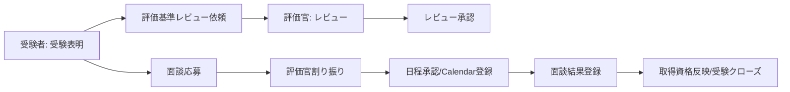

# 評価資料アジェンダ・レイアウト案

作成日: 2026-06-20

## この文書の位置づけ

この文書はTODO 9「評価資料のアジェンダと資料レイアウトだけを先に作成する」の成果物である。

現時点では、評価資料の本作成は行わない。実装前に本資料を作り切ると、コード、テスト、画面、ログ、設定ファイルを証跡として載せられないためである。

この文書では、実装後に差し込む証跡の置き場所、15分発表の流れ、付録資料の構成だけを定義する。

## 基本方針

- アプリケーションは評価基準をすべて満たす前提で作成する。
- 15分発表の主軸は「評価基準を満たすために、今回どの機能をどう開発したか」とする。
- アプリ紹介だけに寄せすぎず、評価軸の抽象説明だけにも寄せすぎない。機能、設計意図、実装箇所、テスト証跡をセットで説明する。
- デモは、開発した機能が実際に動くことを示す証跡として扱う。長い操作説明ではなく、主要機能の動作確認に絞る。
- 15分発表では、評価基準すべてを口頭で説明し切るのではなく、評価基準を満たす代表機能をピックアップして説明する。
- ピックアップしない評価基準も、付録の網羅表に対応機能、コード、テスト、画面、設定ファイル、設計資料の証跡を載せる。
- 試験官から想定外の質問が来た場合は、付録、アプリ画面、コード、テストを使って回答できる状態にする。
- AIリテラシーはアプリ機能としてではなく、開発時のAI出力レビュー補足資料で証明する。

## 作成する資料セット

| 資料 | 目的 | 作成タイミング | 備考 |
| --- | --- | --- | --- |
| 15分発表デッキ | 評価基準を満たすために開発した機能、設計、実装、テストを説明する本編資料 | 実装後に本作成 | TODO 17完了後、TODO 10でピックアップ機能を決める |
| 評価基準網羅表 | 全評価基準に対する証跡を一覧化する | 実装後に本作成 | 対応機能、コードパス、テストパス、画面、設計意図を載せる |
| デモシナリオ | 開発した主要機能が動くことを短時間で示す操作順を固定する | TODO 17完了後、TODO 11で作成 | 15分本編では代表操作に絞る |
| 想定質問対応表 | 質問されたときに提示する画面・コード・資料を整理する | TODO 17完了後、TODO 12で作成 | 評価官の深掘り対策 |
| AI開発レビュー補足資料 | AI出力をどうレビューし、修正したかを説明する | 実装中から記録、実装後に整理 | アプリ機能とは分離する |
| ローカル/Docker構築手順 | PC制約を考慮した複数起動方法を説明する | 実装後に検証結果を反映 | `bin/setup`, `bin/dev`, Dockerの両方を扱う |

## 15分発表アジェンダ案

| 時間 | 内容 | 目的 | 実装後に差し込む証跡 |
| --- | --- | --- | --- |
| 0:00-1:00 | 目的と評価基準の扱い | 今回開発した機能で評価基準を網羅する方針を明示する | 評価基準網羅表の先頭ページ |
| 1:00-2:00 | 開発した機能マップ | どの機能がどの評価基準を満たすかを俯瞰する | 機能一覧、評価基準対応サマリー |
| 2:00-4:00 | 評価基準レビュー機能 | 受験表明、レビュー依頼、提出物、Markdown、レビュー判定をどう開発したか説明する | ReviewApplication、Submission、ReviewDecision、画面、テスト |
| 4:00-5:30 | 面談応募・資格反映機能 | 面談応募、評価官割り当て、Calendar登録、合格判定、資格反映をどう開発したか説明する | InterviewApplication、InterviewResult、UserQualification、service、job |
| 5:30-7:00 | 認証・認可機能 | session、JWT、role/user_roles、Punditで権限差をどう実装したか説明する | controller、policy、request spec |
| 7:00-8:30 | DB・ドメイン設計 | `ExamApplication has_many ReviewApplications`、論理削除、関連、検索をどう設計したか説明する | ER図、Ridgepole Schemafile、model、index |
| 8:30-10:00 | アーキテクチャ構成 | Rails MVC、service/usecase、job、external clientへどう責務分離したか説明する | アーキテクチャ図、主要ディレクトリ、service/policy/job |
| 10:00-11:15 | 状態遷移・トランザクション・例外処理 | 不正遷移防止、同時進行レビュー制御、資格反映transactionをどう実装したか説明する | transition service、model spec、service spec |
| 11:15-12:15 | 外部連携・非同期処理 | Slack送信、Google Calendar、retry/mock切替をどう開発したか説明する | StatusChangeEvent、SlackDelivery、job、client |
| 12:15-13:45 | 代表デモ | 評価基準を満たす主要機能が動くことを短く確認する | ローカル起動画面、デモデータ |
| 13:45-14:30 | テスト・品質・開発基盤 | 開発した機能をどのテストとCIで保証したか説明する | テスト結果、CI設定、RuboCop、構築手順 |
| 14:30-15:00 | AI開発レビューと質疑導線 | AI出力をどうレビューし、質問時にどこを見せるか伝える | AI開発レビュー補足資料、想定質問対応表 |

## 15分発表デッキのレイアウト

### 1. 表紙

目的:

- `SkillEvidenceHub` の名称、発表者、対象評価を示す。

実装後に入れる内容:

- アプリ名
- 対象評価名
- ローカル起動URL
- リポジトリ名

### 2. 評価基準への対応方針

目的:

- 発表では一部をピックアップするが、アプリ・コード・テスト・資料では全評価基準を網羅することを明示する。

実装後に入れる内容:

- 評価基準総数
- Rails特化/バックエンド共通の分類サマリー
- 網羅表への参照

### 3. 開発した機能マップ

目的:

- 今回開発した機能と、それぞれが満たす評価基準の対応を俯瞰する。

実装後に入れる内容:

- 評価基準レビュー機能
- 面談応募・資格反映機能
- 認証・認可機能
- 評価官検索・受験者詳細機能
- マスタ管理・取込・帳票機能
- 外部連携・非同期処理機能
- 各機能が満たす評価基準ID

### 4. 業務フロー

目的:

- 開発した機能が、実業務上どの位置にあるかを示す。

実装後に入れる内容:

### 5. 評価基準レビュー機能

目的:

- 受験者が証跡を提出し、評価官がレビューする機能をどう開発したか説明する。

実装後に入れる内容:

- 受験表明からレビュー依頼を作成できる制御
- ReviewApplicationは複数可、ただし同時進行は1件まで
- Submissionによるファイル/GitHub URL管理
- Markdownアピールコメントの保存とサニタイズ表示
- レビュー依頼の編集/取消
- 評価官の差し戻し/承認/却下
- 対応するmodel、service、validator、request/model spec

### 6. 面談応募・資格反映機能

目的:

- 面談応募から合格判定、取得資格反映までをどう開発したか説明する。

実装後に入れる内容:

- 面談応募は取消不可にする制御と注意喚起
- 面接官未定表示
- 評価官自動フィルインと手動変更
- Google Calendar登録
- 合格/不合格判定
- 合格時のUserQualification反映
- 不合格時の再受験方針
- 対応するservice、job、transaction、test

### 7. 認証・認可機能

目的:

- 利用者種別ごとに異なる操作を、どのように安全に実装したか説明する。

実装後に入れる内容:

- session認証
- API JWT
- refresh token rotation
- role/user_roles
- Pundit policy
- 対応可能評価スキルによる評価官制御
- テナントスコープ
- 認可漏れを防ぐrequest/policy spec

### 8. DB・ドメイン設計

目的:

- 開発した機能を支えるデータ構造、関連、制約を説明する。

実装後に入れる内容:

- `ExamApplication`
- `ReviewApplication`
- `Submission`
- `InterviewApplication`
- `UserQualification`
- `StatusChangeEvent`
- `SlackDelivery`
- Active Storage関連
- `paranoia` による論理削除
- index、unique制約、検索条件

### 9. アーキテクチャ構成

目的:

- 開発した機能を、どの層に責務分離して実装したか説明する。

実装後に入れる内容:

- Rails MVCの責務
- service/usecase層
- Pundit policy
- ActiveJob
- external client
- value object
- validator
- decorator/presenter
- mock/実連携の差し替え境界

### 10. 状態遷移・トランザクション・例外処理

目的:

- 業務ルールを安全に実装するための状態遷移、transaction、例外処理を説明する。

実装後に入れる内容:

- ReviewApplicationは複数可、ただし同時進行は1件まで
- 面談応募は取消不可
- レビュー依頼は取消可
- レビュー削除/取消後のコメント更新エラー制御
- 合格時は資格反映と受験クローズを同一transactionで行う
- 外部連携失敗時の例外とretry/discard

### 11. 外部連携・非同期処理

目的:

- Slack/Google Calendarを、機能から切り離してどう開発したか説明する。

実装後に入れる内容:

- `StatusChangeEvent`
- `SlackDelivery`
- Slack送信Job
- Google Calendar登録Job
- mock/実連携の切替
- retry/discard方針
- 外部API stubを使ったjob/client test

### 12. 代表デモ

目的:

- 開発した機能が動作し、評価基準の証跡として確認できることを短く示す。

実装後に入れる内容:

- 受験表明作成
- レビュー依頼作成
- 評価官レビュー
- 面談応募/評価官割り当て
- 合格判定/資格反映
- 画面とコード/テストの対応箇所

### 13. テスト・品質

目的:

- 開発した機能をどのテストで保証しているか説明する。

実装後に入れる内容:

- model test
- request test
- policy test
- job test
- system test
- RuboCop
- bundle audit
- CI結果

### 14. Docker/ローカル構築

目的:

- PCストレージ制約を考慮し、Dockerとローカル構築の両方に対応していることを示す。

実装後に入れる内容:

- Docker構築手順
- Dockerを使わないローカル構築手順
- 起動確認結果
- seedデータ投入手順

### 15. AI開発レビュー補足

目的:

- AIリテラシーをアプリ機能ではなく、開発プロセスのレビュー証跡として説明する。

実装後に入れる内容:

- AI出力を採用した箇所
- AI出力を修正した箇所
- 不採用にした提案
- セキュリティ、凝集度、結合度、テスト容易性のレビュー観点

### 16. まとめと質疑導線

目的:

- 15分内で説明し切れない項目は、付録と実物で回答できることを伝える。

実装後に入れる内容:

- 重点説明項目のまとめ
- 網羅表、想定質問対応表、コード、テストへの導線

## 評価基準網羅表のレイアウト

実装後に、全評価基準を以下の列で整理する。

| 列 | 内容 |
| --- | --- |
| 評価ID | `R-01`, `B-01` など |
| 評価カテゴリ | Rails特化、バックエンド共通 |
| 評価項目 | 評価基準名 |
| 対応機能 | アプリ上の機能名 |
| 設計証跡 | 設計書、ER図、状態遷移、API仕様など |
| コード証跡 | model、controller、service、job、policyなどのファイルパス |
| テスト証跡 | spec/testファイルパス |
| 画面証跡 | 画面名、スクリーンショット、デモ手順 |
| 発表優先度 | 高/中/低 |
| 想定質問 | 聞かれそうな質問 |
| 回答時に見せるもの | アプリ画面、コード、テスト、資料のどれを見せるか |

## 証跡インデックスのレイアウト

実装後に、評価官へ提示しやすいよう証跡を種類別に整理する。

| 証跡種別 | 載せるもの |
| --- | --- |
| 画面 | 受験表明、レビュー依頼、面談応募、評価官レビュー、受験者検索、取得資格 |
| コード | domain model、service、policy、job、external client、validator |
| DB | Ridgepole Schemafile、ER図、index、lock、soft delete |
| API | REST、GraphQL、ActionCable、OpenAPI |
| テスト | model/request/policy/job/system、外部API mock |
| 開発基盤 | Docker、ローカル構築、RuboCop、CI、bundle audit |
| AIレビュー | AI出力、レビュー観点、採用/修正/不採用判断 |

## デモシナリオの枠

TODO 11で詳細化するが、15分本編で全操作を見せる前提にはしない。本編では代表操作だけを1〜1.5分程度で見せ、残りは質疑や付録で深掘りする。

本編で見せる候補:

1. 受験者が言語/Lvを選んで受験表明する
2. 評価官がレビューキューまたは受験者詳細を開き、提出物と資格反映の流れを確認する

質疑で深掘りする候補:

1. 管理者が受験対象マスタと評価官対応スキルを確認する
2. 受験者が言語/Lvを選んで受験表明する
3. 受験者がレビュー依頼を作成し、提出物とMarkdownコメントを登録する
4. 評価官がレビューキューから対象を確認し、承認する
5. 受験者が面談応募する
6. 評価官が自動フィルインされた面接官を確認し、必要なら変更して確定する
7. 日程承認後にGoogle Calendar登録とSlack送信履歴を確認する
8. 面談後に合格判定し、取得資格に反映されることを確認する

## 本資料作成時の注意

- 実装前に「実装済み」と読める表現は使わない。
- コードパス、テストパス、画面キャプチャは実装後に差し込む。
- 15分発表デッキは説明を絞るが、付録は全評価基準を網羅する。
- 資料だけで満たす項目を作らず、可能な限りアプリ、コード、テスト、設定で示す。
- 評価基準本文の詳細は外部ナレッジ管理を前提とし、このアプリでは言語/Lvと外部参照を保持する設計とする。

## TODO 10への接続

TODO 10では、このレイアウトを前提に、15分発表でピックアップする項目を決める。

ただし、TODO 10〜12は実装前に確定しない。TODO 17でローカル起動と主要動作確認が完了した後、TODO 18の本資料作成に入る直前に実施する。

優先候補は以下である。

- 状態遷移とトランザクション
- 認証・認可・セキュリティ
- DB設計、関連、論理削除、検索性能
- 非同期処理とSlack/Google Calendar外部連携
- テストと品質保証
- AI出力レビューの補足説明
